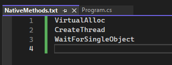

### Getting started

- Open a C\# Project in VS Studio
- Tools -> NuGet Package Manager -> Manage NuGet Packages for Solutions


- Search for cswin32


- Install...this will also install dependencies which need to be accepted (SDK.Win32Metadata, WDK.Metadata, and SDK.Win32Docs)
- From the CsWin32 github page (https://github.com/microsoft/cswin32): "You should also install the `System.Memory` and `System.Runtime.CompilerServices.Unsafe` packages when targeting .NET Framework 4.5+ or .NET Standard 2.0, as these add APIs that significantly improve much of the code generated by CsWin32"
- Search for System.Memory and System.Runtime.CompilerServices.Unsafe and install via the GUI or install via the command line:
```cmd
dotnet add package System.Memory
dotnet add package System.Runtime.CompilerServices.Unsafe
```
* within the source code layout create a text file named `NativeMethods.txt`
* add the APIs needed to `NativeMethods.txt` and each method will be autogenerated



* The APIs can be viewed under Analyzers


### And away you go...

